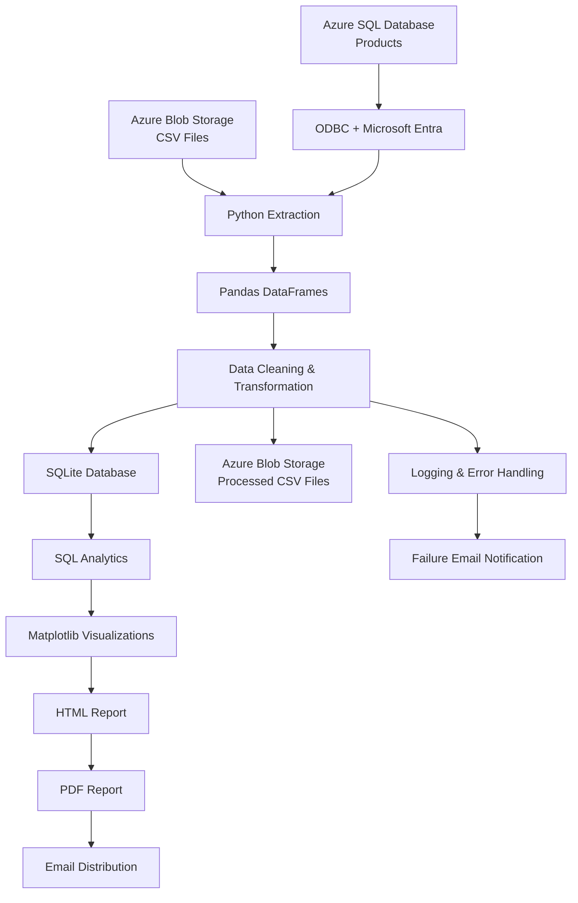

# Azure ETL & Analytics Pipeline

An end-to-end cloud-integrated ETL pipeline built with Python and Microsoft Azure.

The pipeline extracts data from multiple cloud sources including **Azure Blob Storage and Azure SQL Database**, transforms and cleans the data using Pandas, loads processed data into SQLite and Azure Blob Storage, generates analytics visualizations and PDF reports, and automatically distributes reports through email.

## Features

- Multi-source ETL architecture
- Extracts CSV data from Azure Blob Storage
- Extracts Products data from Azure SQL Database
- Uses Microsoft ODBC Driver 18 for SQL Server
- Uses Microsoft Entra authentication for Azure SQL
- Supports configurable Product source selection
- Cleans and transforms data using Pandas
- Standardizes column names
- Handles missing values and duplicate records
- Loads structured data into SQLite
- Uploads cleaned datasets to Azure Blob Storage
- Generates analytics using SQL queries
- Creates visualizations using Matplotlib
- Generates HTML and PDF analytics reports
- Automatically emails PDF reports after successful execution
- Sends email notifications when the pipeline fails
- Logs pipeline execution and errors
- Stage-level exception handling
- Environment-based configuration
- Automated testing with Pytest

## Architecture



## Multi-Source Extraction

The pipeline supports two extraction mechanisms.

### Azure Blob Storage

CSV datasets are downloaded from Azure Blob Storage and converted into Pandas DataFrames.

The Blob source is used for datasets including:

- Customers
- Orders
- Payments
- Products when Azure SQL extraction is disabled

### Azure SQL Database

Products can alternatively be extracted directly from Azure SQL Database.

The connection uses:

- `pyodbc`
- Microsoft ODBC Driver 18 for SQL Server
- Microsoft Entra authentication
- Azure SQL access tokens
- Encrypted database communication

The Product source can be controlled through:

```env
PRODUCTS_FROM_AZURE_SQL=true
```

When set to `true`:

```text
Azure SQL → ODBC → Pandas → Transformation
```

When set to `false`:

```text
Azure Blob CSV → Pandas → Transformation
```

Both extraction paths return a Pandas DataFrame, allowing the same transformation logic to process the data.

## Project Structure

```text
ETL_project/
│
├── etl/
│   ├── azure_sql_extractor.py   # Extracts Products from Azure SQL
│   ├── blob_extractor.py        # Extracts CSV files from Azure Blob Storage
│   ├── transform.py             # Cleans and transforms datasets
│   ├── loader.py                # Loads processed data into SQLite
│   ├── azure_loader.py          # Uploads cleaned data to Azure Blob Storage
│   ├── report.py                # Generates record-count reporting
│   ├── viz.py                   # Creates charts and HTML/PDF reports
│   └── emailer.py               # Sends success/failure emails
│
├── tests/
│   ├── test_transform.py
│   ├── test_azure_sql_extractor.py
│   └── test_blob_extractor.py
│
├── data_backup/
├── reports/
│
├── .env.example
├── .gitignore
├── requirements.txt
├── run_etl.py
├── CAPSTONE_PROJECT.md
└── README.md
```

## Technologies Used

- Python
- Pandas
- Microsoft Azure
- Azure Blob Storage
- Azure SQL Database
- Microsoft Entra ID
- Azure CLI
- pyodbc
- Microsoft ODBC Driver 18 for SQL Server
- SQLite
- SQL
- Matplotlib
- WeasyPrint
- SMTP
- Pytest
- Ruff
- Git & GitHub

## Installation & Setup

### 1. Clone the Repository

```bash
git clone <your-repository-url>
cd ETL_project
```

### 2. Create a Virtual Environment

```bash
python3 -m venv venv
source venv/bin/activate
```

### 3. Install Python Dependencies

```bash
pip install -r requirements.txt
```

### 4. Configure Environment Variables

Copy the example environment file:

```bash
cp .env.example .env
```

Configure your own values:

```env
DATABASE_NAME=
DATA_FOLDER=
LOG_FILE=

AZURE_STORAGE_CONNECTION_STRING=
CONTAINER_NAME=

SENDER_MAIL=
EMAIL_PASSWORD=
RECEIVER_MAIL=

# Azure SQL
PRODUCTS_FROM_AZURE_SQL=false
AZURE_SQL_SERVER=your-server.database.windows.net
AZURE_SQL_DATABASE=your_database_name
```

Never commit the `.env` file because it contains sensitive credentials.

## Azure SQL Setup

Azure SQL connectivity requires:

- Azure CLI
- unixODBC
- Microsoft ODBC Driver 18 for SQL Server
- Microsoft Entra access to the Azure SQL Database

Authenticate with Azure:

```bash
az login
```

To enable Azure SQL extraction:

```env
PRODUCTS_FROM_AZURE_SQL=true
```

The pipeline then extracts Products using:

```sql
SELECT * FROM products
```

To use the Azure Blob CSV source instead:

```env
PRODUCTS_FROM_AZURE_SQL=false
```

## Running the Pipeline

Run:

```bash
python3 run_etl.py
```

The pipeline performs:

1. Multi-source data extraction.
2. Pandas transformation and cleaning.
3. Processed-data upload to Azure Blob Storage.
4. SQLite loading.
5. SQL analytics.
6. Matplotlib visualization generation.
7. HTML report generation.
8. PDF report generation.
9. Automated email distribution.
10. Pipeline logging and failure handling.

## Testing

The project uses Pytest for automated testing.

The test suite validates:

- Product transformation
- Customer transformation
- Order transformation
- Payment transformation
- Missing Azure Blob source handling
- Invalid Azure SQL query handling

Run:

```bash
python3 -m pytest -v
```

Current result:

```text
6 passed
```

## Code Quality

Ruff is used for Python code-quality checks.

Run:

```bash
ruff check .
```

Current result:

```text
All checks passed!
```

## macOS WeasyPrint Note

If WeasyPrint cannot locate the required system libraries:

```bash
brew install glib pango
```

For Apple Silicon Macs, if necessary:

```bash
export DYLD_FALLBACK_LIBRARY_PATH=/opt/homebrew/lib
```

## Final Pipeline Result

The completed pipeline successfully integrates Azure SQL and Azure Blob Storage in a single ETL workflow.

Example final analytics output:

```text
Products loaded: 5
Customers loaded: 4
Orders loaded: 4
Payments loaded: 4

Total Products: 5
Total Customers: 4
Total Orders: 4
Total Revenue: 73200.0
```

## Security

Sensitive credentials are stored using environment variables.

The `.env` file is excluded from Git using `.gitignore`, while `.env.example` documents the required configuration without exposing real credentials.

Azure SQL authentication uses Microsoft Entra access tokens instead of hardcoded SQL passwords.

## Documentation

Detailed architecture, setup instructions, testing information, and implementation details are available in:

```text
CAPSTONE_PROJECT.md
```